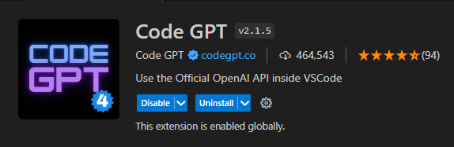
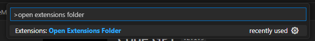
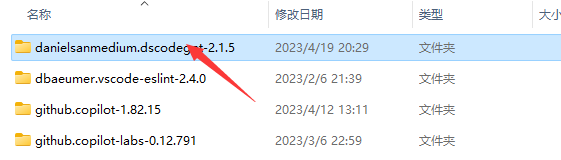
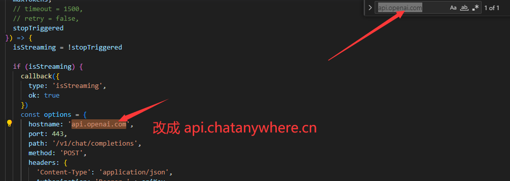
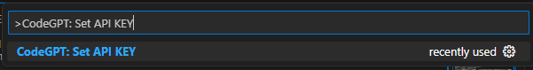
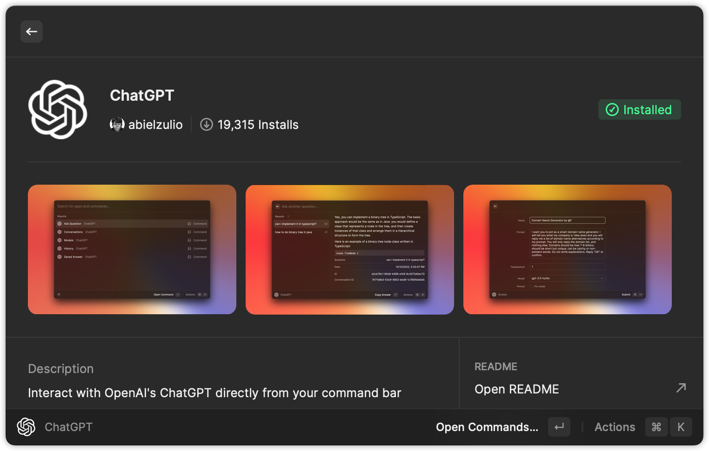
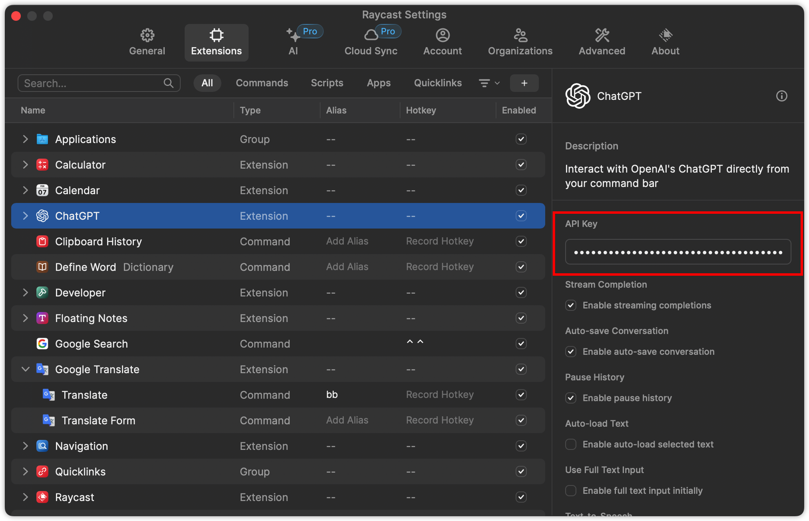
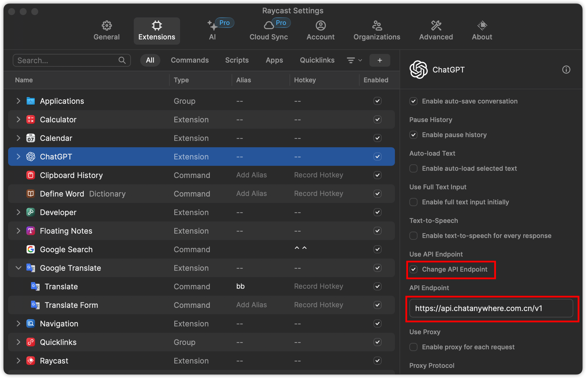

<div align="center">

<h1 align="center">GPT-API-free</h1>

支持 **GPT-4** / GPT-3.5-turbo / embeddings / DALL·E / text-davinci

国内动态加速 直连无需代理

[镜像站](https://chatapi.chatanywhere.com.cn/) / [快速开始](#如何使用) / [领取免费Key](https://api.chatanywhere.cn/v1/oauth/free/github/render) / [支持付费Key](https://peiqi.shop/)

[QQ群: 188070725](https://qm.qq.com/cgi-bin/qm/qr?k=mLPXAqAWpnJgoNFEm5A3fK9u2sNa98zo&jump_from=webapi&authKey=rZBxt+2GslqlsGQyshQvhkqTOz1bTaK0jVBPhCo2lCEf7tTmOa3MiRxJDp6zHAZ3)

</div>

## 隐私声明

该项目高度重视隐私，致力于保护其用户的隐私。该项目不会以任何方式收集、记录或存储用户输入的任何文本或由 OpenAI 服务器返回的任何文本。该项目不会向 OpenAI 或任何第三方提供有关 API 调用者的身份的任何信息，包括但不限于 IP 地址和用户代理字符串。

但OpenAI官方会根据其[数据使用政策](https://platform.openai.com/docs/data-usage-policies)保留 30 天的数据。

## 特点
1. 支持Models, Embedding, text-davinci, GPT3.5, ***GPT4***(免费版不支持), ***DALLE***(免费版不支持)。（免费版就可以支持AutoGPT以及gpt_academic）
2. 与官方完全一致的接口标准，兼容各种软件/插件。
3. 支持流式响应。
4. 国内线路使用动态加速，体验远优于使用代理连接官方。
5. 无需科学上网，国内环境直接可用。
6. 个人完全免费使用。

## 免费使用

- **🚀[点击领取免费API Key](https://api.chatanywhere.cn/v1/oauth/free/github/render)**
- **转发Host1: `https://api.chatanywhere.cn` (国外服务器使用)**
- **转发Host2: `https://api.chatanywhere.com.cn` (国内中转，延时更低，推荐)**

***免费key请勿用于镜像站 https://chatapi.chatanywhere.com.cn/ 会报错***

**免费API Key仅可用于个人非商业用途，教育，非营利性科研工作中。严禁商用！**

为了该项目长久发展，免费API限制**120请求/小时/IP&Key**调用频率，也就是说你如果在一个IP下使用多个Key，所有Key的每小时请求数总和不能超过120；同理，你如果将一个Key用于多个IP，这个Key的每小时请求数也不能超过120。


我们会定期根据使用量进行相应的扩容，只要不被官方制裁我们会一直提供免费API，如果该项目对你有帮助，还请为我们点一个***Star***。如果遇到问题可以在[Issues](https://github.com/chatanywhere/GPT_API_free/issues)中反馈，有空会解答。

该API Key用于转发API，需要将Host改为`api.chatanywhere.cn`或者`api.chatanywhere.com.cn`(国内首选)

## 付费版API
- [购买低价付费Key](https://peiqi.shop/)

1. **支持GPT4 API**，价格仅官方价格五折。
1. 性价比高，除了GPT4的其他模型价格相当于官网价格七分之一。
2. 同官网计费策略，流式问答使用tiktoken库准确计算Tokens，非流式问答直接使用官方返回Tokens用量计费。
3. 余额不会过期，永久有效。根据用户反馈30块钱个人中度使用GPT3.5估计能用一年。

## 如何使用
- 🚀[领取免费API Key](https://api.chatanywhere.cn/v1/oauth/free/github/render) 或 [购买付费API Key](https://peiqi.shop/)***（免费key请勿用于 https://chatapi.chatanywhere.com.cn/ 会报错）***
- 转发Host1: `https://api.chatanywhere.cn` (国外服务器使用)
- 转发Host2: `https://api.chatanywhere.com.cn` (国内中转，延时更低，推荐)
- 余额和使用记录查询（通知公告也会发在这里）: [余额查询及公告](https://api.chatanywhere.cn/)
- 转发API无法直接向官方接口api.openai.com发起请求，需要将请求地址改为api.chatanywhere.com.cn才可以使用，大部分插件和软件都可以修改。

## 常见软件/插件使用方法

### 最方便的使用方法
为了方便大家使用，我们搭建基于开源项目搭建了两个镜像：

1. 基于[ChatGPT-Next-Web](https://github.com/Yidadaa/ChatGPT-Next-Web)，国内部署，速度快，稳定。 https://chatapi.chatanywhere.com.cn/ 
2. 基于[川虎Chat](https://github.com/GaiZhenbiao/ChuanhuChatGPT)，支持联网功能，支持上传PDF分析，国外部署，可能部分人的网络环境访问卡顿。https://chat1.chatanywhere.cn/ 

***由于对IP的访问速率限制，免费Key请勿在这两个上使用，会报错too many requests***

### **python openai官方库（使用AutoGPT等）**
示例代码请参考[demo.py](./demo.py)

***方法一***

```python
import openai
openai.api_base = "https://api.chatanywhere.com.cn/v1"
# openai.api_base = "https://api.chatanywhere.cn/v1"
```

***方法二***

修改环境变量OPENAI_API_BASE，各个系统怎么改环境变量请自行搜索，修改环境变量后不起作用请重启系统。
```bash
OPENAI_API_BASE=https://api.chatanywhere.com.cn/v1
或 OPENAI_API_BASE=https://api.chatanywhere.cn/v1
```
### **开源gpt_academic**
找到`config.py`文件中的`API_URL_REDIRECT`配置并修改为以下内容：
```python
API_URL_REDIRECT = {"https://api.openai.com/v1/chat/completions": "https://api.chatanywhere.com.cn/v1/chat/completions"}
# API_URL_REDIRECT = {"https://api.openai.com/v1/chat/completions": "https://api.chatanywhere.cn/v1/chat/completions"}
```

### **ChatBox(推荐使用)**

ChatGPT开源桌面应用，支持全部桌面平台。

下载链接：https://github.com/Bin-Huang/chatbox/releases

使用方法：如图在设置中填入购买的密钥，并将代理设置为`https://api.chatanywhere.cn` 或者 `https://api.chatanywhere.com.cn` 即可


### **浏览器插件ChatGPT Sidebar**

官网链接：https://chatgpt-sidebar.com/

安装好插件后进入设置页面，如图所示修改设置，将url修改为 `https://api.chatanywhere.cn` 或者 `https://api.chatanywhere.com.cn` 。


### **Jetbrains插件ChatGPT**


安装好插件后在Settings > Tools > OpenAI > GPT 3.5 Turbo中如图所示配置好插件，重点要将Server Settings 修改为 `https://api.chatanywhere.cn/v1/chat/completions` 或者 `https://api.chatanywhere.com.cn/v1/chat/completions` 。并勾选Customize Server。


### **VSCode插件Code GPT**


这个插件修改Host相对麻烦一些，需要修改源码才可以使用。

1. 安装插件。安装好后按Ctrl+Shift+P，弹出框中输入Open Extensions Floder


2. 点击Extensions: Open Extensions Floder，这将打开插件目录，找到Code GPT的文件夹。


3. 打开后进入打开文件./src/clients/openai_client.js，搜索文件中的api.openai.com，并替换为 `api.chatanywhere.cn` 或者 `api.chatanywhere.com.cn`。保存文件。


4. 再次回到vscode，按Ctrl+Shift+P，弹出框中输入CodeGPT: Set API KEY，点击CodeGPT: Set API KEY。然后将购买的Key输入进去即可。


5. 以上步骤完成后，重启VSCode

- 其他VSCode插件类似。

### **Raycast 插件 ChatGPT（推荐使用）**

1. 在 Raycast Store 中找到 ChatGPT 插件，并按照提示安装：


2. 安装完成后在该插件配置中的 `API Key` 中填入免费API Key：`sk-0PfcSdT723UR44igwVxvEWvLoZJgi0FJyZWy0WCCATp5ka2a` 或 [付费购买的 API Key](https://peiqi.shop/)，以及选中 `Change API Endpoint`，并在 `API Endpoint` 中填入 `https://api.chatanywhere.com.cn/v1`



3. 🍺 enjoy it~


## API报错说明
- Overload错误

具体错误信息：
```
{
  "error": {
    "message": "That model is currently overloaded with other requests. You can retry your request, or contact us through our help center at help.openai.com if the error persists. (Please include the request ID xxxxxxxxxxxx in your message.)",
    "type": "server_error",
    "param": null,
    "code": null
  }
}
```
该错误由于OpenAI官方服务器负载高引起，与转发服务器负载无关。一般一段时间后恢复，可以等一段时间后再试，具体等待时间可能是几秒钟，也能是半小时。


[](https://star-history.com/#star-history/star-history&Date)