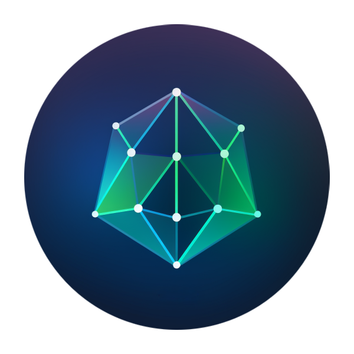
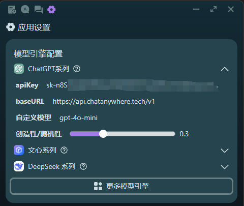
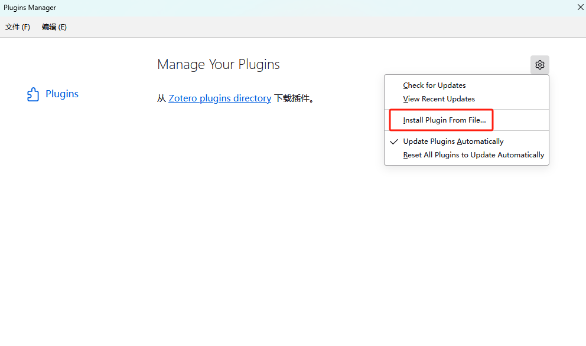
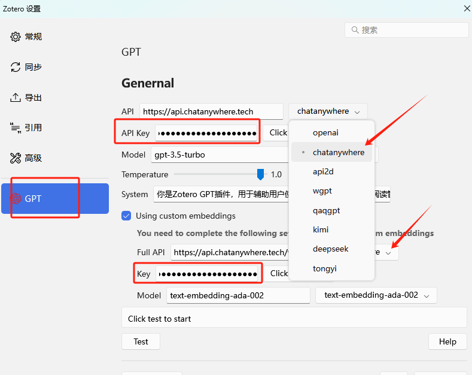
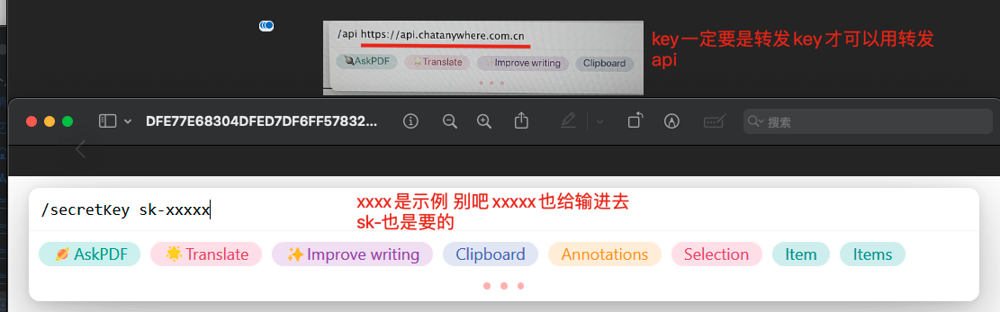
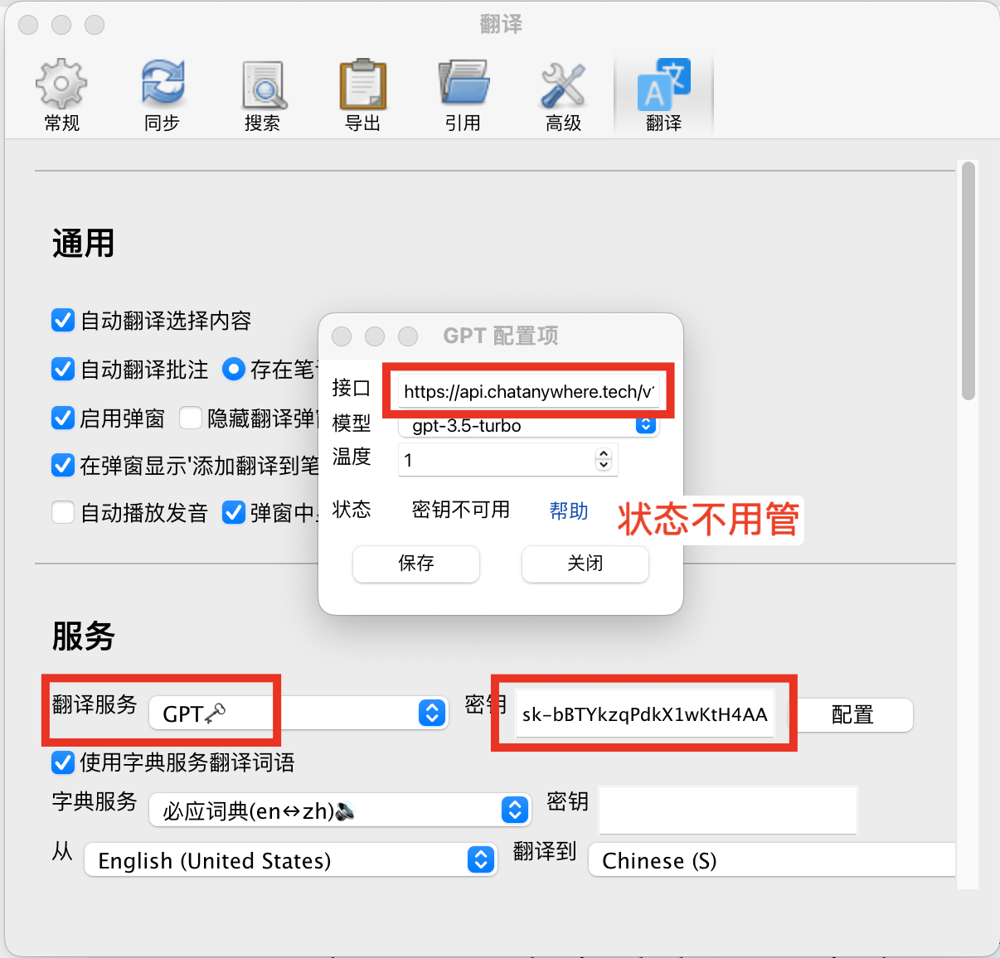
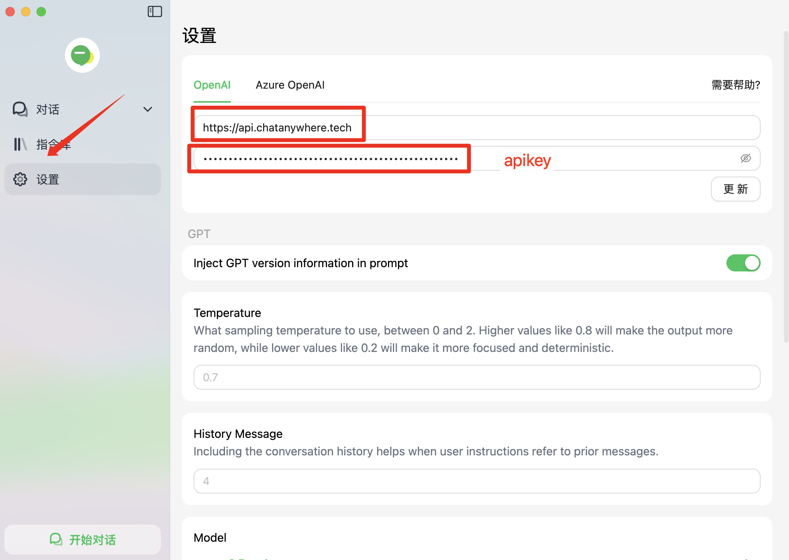
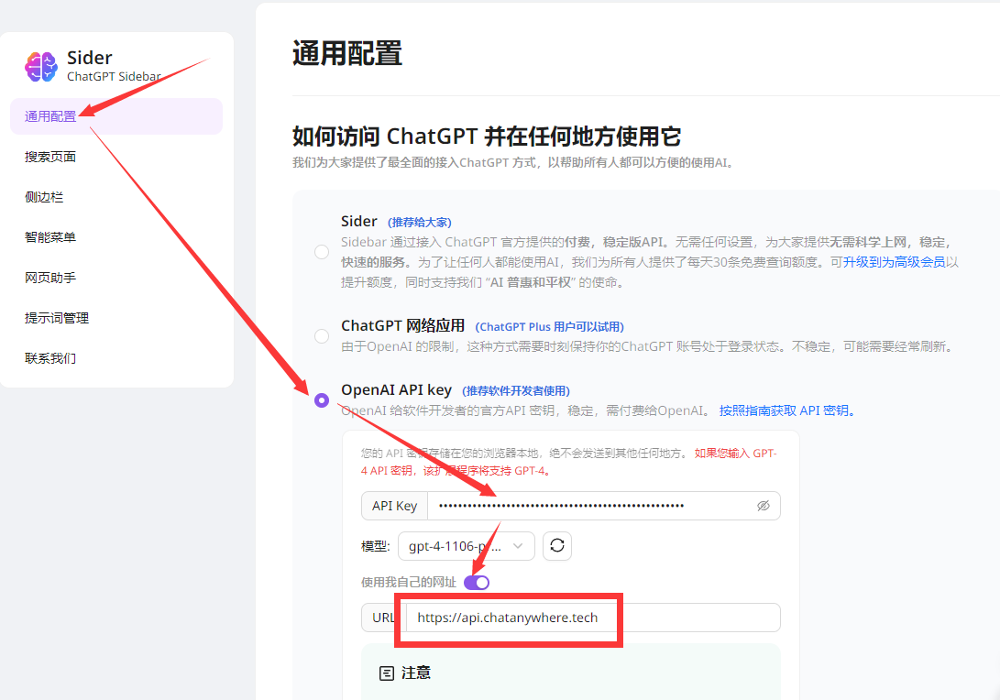
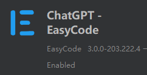
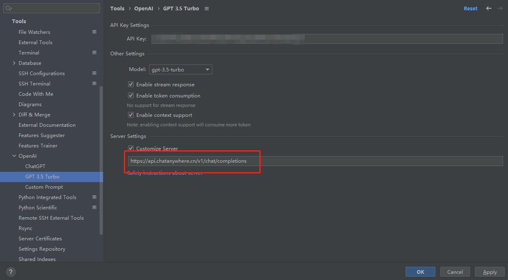

<div align="center">

<h1 align="center">GPT-API-free / DeepSeek-API-free</h1>

免费使用 gpt-5 | deepseek

支持 gpt | deepseek | claude | gemini | grok

国内动态加速 直连无需代理 协议统一接入便捷

[快速开始](#如何使用) / [API文档](https://chatanywhere.apifox.cn/) / [申请内测免费Key](https://api.chatanywhere.tech/v1/oauth/free/render) / [支持付费Key](https://api.chatanywhere.tech/#/shop/) / [服务可用性](https://status.chatanywhere.tech/)

[QQ群: 1065098525](https://qm.qq.com/cgi-bin/qm/qr?k=nUFEPRzZefTU141x_ddiMb-dgN5DmgZf&jump_from=webapi&authKey=NYmMyyZT1sX4B4S2asWFSyFvc+WXJtQBrBsQdsP8d88lGloFXBZUuWsxwMZgWUm2)

[](https://status.chatanywhere.tech/)
[](https://status.chatanywhere.tech/)

[](https://status.chatanywhere.tech/)
[](https://status.chatanywhere.tech/)
[](https://status.chatanywhere.tech/)


</div>

## 隐私声明

该项目高度重视隐私，致力于保护其用户的隐私。该项目不会以任何方式收集、记录或存储用户输入的任何文本或由 OpenAI 服务器返回的任何文本。该项目不会向 OpenAI 或任何第三方提供有关 API 调用者的身份的任何信息，包括但不限于 IP 地址和用户代理字符串。

但OpenAI官方会根据其[数据使用政策](https://platform.openai.com/docs/data-usage-policies)保留 30 天的数据。

## 特点
1. 支持 gpt | deepseek | claude | gemini | grok 等排名靠前的常用大模型。
2. 免费版支持gpt-5, gpt-4o，gpt-4.1一天5次；支持deepseek-r1, deepseek-v3, deepseek-v3-2-exp一天30次，支持gpt-4o-mini，gpt-3.5-turbo，gpt-4.1-mini，gpt-4.1-nano, gpt-5-mini，gpt-5-nano一天200次。
3. 与官方完全一致的接口标准，兼容各种软件/插件。
4. 支持流式响应。
5. 国内线路使用动态加速，体验远优于使用代理连接官方。
6. 无需科学上网，国内环境直接可用。
7. 个人完全免费使用。
8. 协议统一使用openai标准协议，其他厂商模型仅需更换模型名称，接入便捷

## 🚩注意事项

❗️*如果遇到无回复，报错等情况，可以查看 [status.chatanywhere.tech](https://status.chatanywhere.tech)，确认服务状态是否正常，以帮助排查问题。*

❗️*免费API Key gpt-5系列模型的推理能力较弱，若需要更强的推理能力，可以购买付费API*

❗️**免费API Key仅可用于个人非商业用途，教育，非营利性科研工作中。免费API Key严禁商用，严禁大规模训练商用模型！训练科研用模型请提前加群联系我们。**

❗️我们将不定期对被滥用的Key进行封禁，如发现自己的key被误封请通过QQ群联系我们。

❗️我们的系统仅供内部评估测试使用，商用或面向大众使用请自行承担风险。

为了该项目长久发展，免费API Key限制**200请求/天/IP&Key**调用频率（gpt和embedding分开计算，各200次），也就是说你如果在一个IP下使用多个Key，所有Key的每天请求数总和不能超过200；同理，你如果将一个Key用于多个IP，这个Key的每天请求数也不能超过200。(**付费版API没有这个限制**)

## 免费使用

- **🚀[申请领取内测免费API Key](https://api.chatanywhere.tech/v1/oauth/free/render)**
- 免费版支持deepseek, gpt-3.5-turbo, embedding, gpt-4o系列, gpt-5系列。
- **转发Host1: `https://api.chatanywhere.tech` (国内中转，延时更低)**
- **转发Host2: `https://api.chatanywhere.org` (国外使用)**


我们会定期根据使用量进行相应的扩容，只要不被官方制裁我们会一直提供免费API，如果该项目对你有帮助，还请为我们点一个***Star***。如果遇到问题可以在[Issues](https://github.com/chatanywhere/GPT_API_free/issues)中反馈，有空会解答。

该API Key用于转发API，需要将Host改为`api.chatanywhere.tech`(国内首选)或者`api.chatanywhere.org`(国外使用)。

## 付费版API
- 纯公益提供免费Key显然不是能持久运营下去的方案，所以我们引入付费API Key维持项目的日常开销，以促进项目的良性循环，还望大家理解。
- [购买付费Key](https://api.chatanywhere.tech/#/shop/)
- [付费版价格表](https://chatanywhere.apifox.cn/doc-2694962)

1. 支持**更稳定更快速的GPT4 API**，GPT4体验更好，无限使用，价格低于官方，充值更便捷。
2. 同官网计费策略，流式问答使用tiktoken库准确计算Tokens，非流式问答直接使用官方返回Tokens用量计费。
3. 余额不会过期，永久有效。根据用户反馈30块钱个人中度使用gpt-4o-mini估计能用半年。
4. 所有的接口（包括免费版本）都保证转发自OpenAI或Azure官方接口，非peo、plus等不稳定方案或逆向方案，无水分，不掺假，保证稳定性。

## 付费版支持模型


| **模型（Model）** | **请求（Input）** | **回答（Output）** | **是否支持** | **特点** |
| --- | --- | --- | --- | --- |
| gpt-5 | 0.00875 / 1K Tokens | 0.07  / 1K Tokens | 支持 | GPT-5 是用于跨领域编码、推理和代理任务的旗舰模型 |
| gpt-5-mini | 0.00175 / 1K Tokens | 0.014  / 1K Tokens | 支持 |GPT-5 mini 是 GPT-5 的一个更快、更经济的版本。它非常适合执行定义明确的任务和精准的提示 |
| gpt-5-nano | 0.00035 / 1K Tokens | 0.0028  / 1K Tokens | 支持 |GPT-5 Nano 是速度最快、成本最低的 GPT-5 版本。它非常适合摘要和分类任务 |
| gpt-5-chat-latest |0.00875 / 1K Tokens | 0.07 / 1K Tokens | 支持 | GPT-5 Chat 指的是 ChatGPT 当前使用的 GPT-5 快照|
| o3 | 0.014 / 1K Tokens | 0.056  / 1K Tokens | 支持 | 为数学、科学、编码、视觉推理任务和技术写作设定了新的标准。 指向o3-2025-04-16|
| o3-2025-04-16 | 0.014 / 1K Tokens | 0.056   / 1K Tokens | 支持 | 为数学、科学、编码、视觉推理任务和技术写作设定了新的标准。 |
| o4-mini | 0.0088 / 1K Tokens | 0.0352  / 1K Tokens | 支持 | 为数学、科学、编码、视觉推理任务和技术写作设定了新的标准。 指向o4-mini-2025-04-16|
| o4-mini-2025-04-16 | 0.0088 / 1K Tokens | 0.0352  / 1K Tokens | 支持 | 为数学、科学、编码、视觉推理任务和技术写作设定了新的标准。 |
| gpt-4.1 |  0.014 / 1K Tokens | 0.056   / 1K Tokens | 支持 | OpenAI最新推出的模型 在编码、指令跟踪和长上下文方面都有重大改进1M输入32k输出 指向gpt-4.1-2025-04-14 |
| gpt-4.1-2025-04-14 | 0.014 / 1K Tokens | 0.056  / 1K Tokens | 支持 | OpenAI最新推出的模型 在编码、指令跟踪和长上下文方面都有重大改进1M输入32k输出|
| gpt-4.1-mini | 0.0028 / 1K Tokens | 0.0112  / 1K Tokens | 支持 | OpenAI最新推出的模型 在编码、指令跟踪和长上下文方面都有重大改进1M输入32k输出 指向gpt-4.1-mini-2025-04-14 |
| gpt-4.1-mini-2025-04-14 | 0.0028 / 1K Tokens | 0.0112  / 1K Tokens | 支持 | OpenAI最新推出的模型 在编码、指令跟踪和长上下文方面都有重大改进1M输入32k输出|
| gpt-4.1-nano | 0.0007 / 1K Tokens | 0.0028  / 1K Tokens | 支持 | OpenAI最新推出的模型 在编码、指令跟踪和长上下文方面都有重大改进1M输入32k输出 指向gpt-4.1-nano-2025-04-14 |
| gpt-4.1-nano-2025-04-14 | 0.0007 / 1K Tokens | 0.0028  / 1K Tokens | 支持 | OpenAI最新推出的模型 在编码、指令跟踪和长上下文方面都有重大改进1M输入32k输出|
| gpt-oss-20b| 0.0008 / 1K Tokens | 0.0032  / 1K Tokens | 支持 | OpenAI最新推出的开源模型|
| gpt-oss-120b| 0.0044 / 1K Tokens | 0.0176  / 1K Tokens | 支持 | OpenAI最新推出的开源模型|
| gpt-3.5-turbo | 0.0035 / 1K Tokens | 0.0105 / 1K Tokens | 支持 | 默认模型，等于gpt-3.5-turbo-0125|
| gpt-3.5-turbo-1106 | 0.007 / 1K Tokens | 0.014 / 1K Tokens | 支持 | 2023年11月6日更新的模型|
| gpt-3.5-turbo-0125 | 0.0035 / 1K Tokens | 0.0105 / 1K Tokens | 支持 | 2024年1月25日最新模型，数据最新，价格更更低，速度更快，修复了一些1106的bug。|
| gpt-3.5-turbo-16k | 0.021 / 1K Tokens | 0.028 / 1K Tokens | 支持 | 适合快速回答简单问题,字数更多 |
| gpt-3.5-turbo-instruct | 0.0105 / 1K Tokens | 0.014 / 1K Tokens | 支持 |Completions模型 用于文本生成，提供准确的自然语言处理模型一般人用不上|
| o1-mini | 0.0088 / 1K Tokens | 0.0352 / 1K Tokens | 支持 | 针对复杂任务的推理模型 |
| o1-preview | 0.105 / 1K Tokens | 0.42 / 1K Tokens | 支持 | 针对复杂任务的推理模型 |
| o3-mini [5]| 0.0088 / 1K Tokens | 0.0352 / 1K Tokens | 支持 | 针对复杂任务的推理模型 |
| o1 [5]| 0.12 / 1K Tokens | 0.48 / 1K Tokens | 支持 | o1系列模型经过强化学习训练，可以进行复杂的推理。o1模型在回答之前会思考，在回应用户之前会产生一长串的内部思维链 |
| gpt-4o-search-preview  | 0.0175/1K Tokens| 0.07/1K Tokens + 搜索费用[6]| 支持 | Openai 出的搜索模型,支持网络搜索,指向最新的4o的搜索模型|
| gpt-4o-search-preview-2025-03-11| 0.0175/1K Tokens| 0.07/1K Tokens + 搜索费用[6]| 支持 | Openai 出的搜索模型,支持网络搜索|
| gpt-4o-mini-search-preview | 0.00105/1K Tokens| 0.0042/1K Tokens + 搜索费用[6]| 支持 | Openai 出的搜索模型,支持网络搜索,指向最新的4o-mini的搜索模型|
| gpt-4o-mini-search-preview-2025-03-11 |0.00105/1K Tokens| 0.0042/1K Tokens + 搜索费用[6]| 支持 | Openai 出的搜索模型,支持网络搜索|
| gpt-4 | 0.21 / 1K Tokens | 0.42 / 1K Tokens | 支持 | 默认模型，等于gpt-4-0613 |
| gpt-4o | 0.0175/1K Tokens + 图片费用[2]| 0.07/1K Tokens| 支持 | Openai 价格更低, 速度更快更聪明,指向最新版的4o版本|
| gpt-4o-2024-05-13 | 0.035/1K Tokens + 图片费用[2]| 0.105/1K Tokens | 支持 | Openai 2024-05-13出的gpt-4o模型|
| gpt-4o-2024-08-06 | 0.0175/1K Tokens + 图片费用[2]| 0.07/1K Tokens | 支持 | Openai 2024-08-06出的gpt-4o模型 支持128k输入,16k输出|
| gpt-4o-2024-11-20 | 0.0175/1K Tokens + 图片费用[2]| 0.07/1K Tokens | 支持 | Openai 2024-11-20出的gpt-4o模型, 该模型的创意写作能力得到了提升一更自然、更有吸引力、更有针对性的写作|
| chatgpt-4o-latest | 0.035/1K Tokens + 图片费用[2]| 0.105/1K Tokens | 支持 | 动态更新的版本，持续集成OpenAI最新的研究成果[4]|
| gpt-4o-mini | 0.00105/1K Tokens + 图片费用[2]| 0.0042/1K Tokens| 支持 | Openai 最新模型, 价格更低, 输出质量在3.5之上4o之下, 并且支持读图|
| gpt-4-0613 | 0.21 / 1K Tokens | 0.42 / 1K Tokens | 支持 | 2023年6月13日更新的模型 |
| gpt-4-turbo-preview | 0.07 / 1K Tokens| 0.21 / 1K Tokens | 支持 | 最新模型，输入128K，输出最大4K，知识库最新2023年4月, 此模型始终指向最新的4的preview模型|
| gpt-4-0125-preview | 0.07 / 1K Tokens| 0.21 / 1K Tokens | 支持 | 2024年1月25日更新的模型，输入128K，输出最大4K，知识库最新2023年4月, 修复了一些1106的bug|
| gpt-4-1106-preview | 0.07 / 1K Tokens| 0.21 / 1K Tokens | 支持 | 2023年11月6日更新的模型，输入128K，输出最大4K，知识库最新2023年4月|
| gpt-4-vision-preview | 0.07 / 1K Tokens + 图片费用[2]| 0.21 / 1K Tokens | 支持 |多模态，支持图片识别|
| gpt-4-turbo | 0.07 / 1K Tokens + 图片费用[2]| 0.21 / 1K Tokens | 支持 | Openai 最新模型多模态，支持图片识别，支持函数tools|
| gpt-4-turbo-2024-04-09 | 0.07 / 1K Tokens + 0.10115\*图片个数[2]| 0.21 / 1K Tokens | 支持 | Openai 最新模型多模态，支持图片识别，支持函数tools|
| gpt-5-ca | 0.005 / 1K Tokens | 0.04  / 1K Tokens | 支持 | 第三方优质提供商提供的服务,优点价格便宜,但是稳定性没有非-ca的好, 模型返回和能力都是一样的 |
| gpt-5-mini-ca | 0.001  / 1K Tokens | 0.008  / 1K Tokens | 第三方优质提供商提供的服务,优点价格便宜,但是稳定性没有非-ca的好, 模型返回和能力都是一样的|
| gpt-5-nano-ca | 0.0002 / 1K Tokens | 0.0016  / 1K Tokens | 第三方优质提供商提供的服务,优点价格便宜,但是稳定性没有非-ca的好, 模型返回和能力都是一样的|
| gpt-5-chat-latest-ca |0.005 / 1K Tokens | 0.04 / 1K Tokens | 第三方优质提供商提供的服务,优点价格便宜,但是稳定性没有非-ca的好, 模型返回和能力都是一样的|
| gpt-4.1-ca| 0.008 / 1K Tokens | 0.032 / 1K Tokens | 支持 | 第三方优质提供商提供的服务,优点价格便宜,但是稳定性没有非-ca的好, 模型返回和能力都是一样的|
| gpt-4.1-mini-ca | 0.0016 / 1K Tokens | 0.0064 / 1K Tokens | 支持 | 第三方优质提供商提供的服务,优点价格便宜,但是稳定性没有非-ca的好, 模型返回和能力都是一样的|
| gpt-4.1-nano-ca | 0.0004 / 1K Tokens | 0.003 / 1K Tokens | 支持 | 第三方优质提供商提供的服务,优点价格便宜,但是稳定性没有非-ca的好, 模型返回和能力都是一样的|
| gpt-3.5-turbo-ca | 0.001 / 1K Tokens | 0.0016  / 1K Tokens | 支持 | 第三方优质提供商提供的服务,优点价格便宜,但是稳定性没有非-ca的好, 模型返回和能力都是一样的|
| gpt-4-ca | 0.12 / 1K Tokens | 0.24 / 1K Tokens | 支持 |第三方优质提供商提供的服务,优点价格便宜,但是稳定性没有非-ca的好, 模型返回和能力都是一样的|
| gpt-4-turbo-ca | 0.04 / 1K Tokens + 0.0578\*图片个数[3]| 0.12 / 1K Tokens | 支持 |第三方优质提供商提供的服务,优点价格便宜,但是稳定性没有非-ca的好, 模型返回和能力都是一样的|
| gpt-4o-ca | 0.01 / 1K Tokens + 0.0289\*图片个数[3]| 0.04 / 1K Tokens | 支持 | 第三方优质提供商提供的服务,优点价格便宜,但是稳定性没有非-ca的好, 模型返回和能力都是一样的|
| gpt-4o-mini-ca | 0.00075 / 1K Tokens| 0.003 / 1K Tokens | 支持 | 第三方优质提供商提供的服务,优点价格便宜,但是稳定性没有非-ca的好, 模型返回和能力都是一样的|
| o1-mini-ca | 0.012 / 1K Tokens | 0.048 / 1K Tokens | 支持 | 第三方优质提供商提供的服务,优点价格便宜,但是稳定性没有非-ca的好, 模型返回和能力都是一样的 |
| o1-preview-ca | 0.06 / 1K Tokens | 0.24 / 1K Tokens | 支持 | 第三方优质提供商提供的服务,优点价格便宜,但是稳定性没有非-ca的好, 模型返回和能力都是一样的 |
| deepseek-v3-2-exp |  0.0012  / 1K Tokens | 0.0018 / 1K Tokens | 支持 |deepseek的聊天模型, 此模型由第三方(火山引擎)供应商提供，有小概率可能会出现响应速度较慢或报错的情况。|
| deepseek-v3.1-250821 |  0.0024  / 1K Tokens | 0.0072 / 1K Tokens | 支持 |deepseek的聊天模型, 此模型由第三方(火山引擎)供应商提供，有小概率可能会出现响应速度较慢或报错的情况。|
| deepseek-v3.1-think-250821 | 0.0024  / 1K Tokens | 0.0072 / 1K Tokens | 支持 |deepseek的聊天模型, 此模型由第三方(火山引擎)供应商提供，有小概率可能会出现响应速度较慢或报错的情况。|
| deepseek-reasoner | 0.0036  / 1K Tokens | 0.0144 / 1K Tokens | 支持 |deepseek的思考R1模型, 此模型由第三方供应商自己部署提供，有小概率可能会出现响应速度较慢或报错的情况。|
| deepseek-r1 | 0.0024  / 1K Tokens | 0.0096 / 1K Tokens | 支持 |deepseek的思考R1模型, 此模型由第三方(火山引擎)供应商提供，有小概率可能会出现响应速度较慢或报错的情况。|
| deepseek-r1-250528 | 0.0024  / 1K Tokens | 0.0096 / 1K Tokens | 支持 |deepseek的思考R1模型, 此模型由第三方(火山引擎)供应商提供，有小概率可能会出现响应速度较慢或报错的情况。|
| deepseek-v3 | 0.0012  / 1K Tokens | 0.0048 / 1K Tokens | 支持 |deepseek的聊天模型, 此模型由第三方(火山引擎)供应商提供，有小概率可能会出现响应速度较慢或报错的情况。|
| deepseek-chat | 0.0012  / 1K Tokens | 0.0048 / 1K Tokens | 支持 |deepseek的聊天模型, 此模型由第三方(火山引擎)供应商提供，有小概率可能会出现响应速度较慢或报错的情况。|
| claude-sonnet-4-5-20250929 | 0.015 / 1K Tokens | 0.075 / 1K Tokens | 支持 |claude的模型, 此模型由第三方供应商提供，有小概率可能会出现响应速度较慢或报错的情况。|
| claude-sonnet-4-5-20250929-thinking | 0.015 / 1K Tokens | 0.075 / 1K Tokens | 支持 |claude的模型, 此模型由第三方供应商提供，有小概率可能会出现响应速度较慢或报错的情况。|
| claude-opus-4-1-20250805 | 0.075 / 1K Tokens | 0.375 / 1K Tokens | 支持 |claude的模型, 此模型由第三方供应商提供，有小概率可能会出现响应速度较慢或报错的情况。|
| claude-opus-4-1-20250805-thinking | 0.075 / 1K Tokens | 0.375 / 1K Tokens | 支持 |claude的模型, 此模型由第三方供应商提供，有小概率可能会出现响应速度较慢或报错的情况。|
| claude-opus-4-20250514 | 0.075 / 1K Tokens | 0.375 / 1K Tokens | 支持 |claude的模型, 此模型由第三方供应商提供，有小概率可能会出现响应速度较慢或报错的情况。|
| claude-opus-4-20250514-thinking | 0.075 / 1K Tokens | 0.375 / 1K Tokens | 支持 |claude的模型, 此模型由第三方供应商提供，有小概率可能会出现响应速度较慢或报错的情况。|
| claude-sonnet-4-20250514 | 0.015 / 1K Tokens | 0.075 / 1K Tokens | 支持 |claude的模型, 此模型由第三方供应商提供，有小概率可能会出现响应速度较慢或报错的情况。|
| claude-sonnet-4-20250514-thinking | 0.015 / 1K Tokens | 0.075 / 1K Tokens | 支持 |claude的模型, 此模型由第三方供应商提供，有小概率可能会出现响应速度较慢或报错的情况。|
| claude-3-7-sonnet-20250219 | 0.015 / 1K Tokens | 0.075 / 1K Tokens | 支持 |claude的模型, 此模型由第三方供应商提供，有小概率可能会出现响应速度较慢或报错的情况。|
| claude-3-5-sonnet-20240620 | 0.015 / 1K Tokens | 0.075 / 1K Tokens | 支持 |claude的模型, 此模型由第三方供应商提供，有小概率可能会出现响应速度较慢或报错的情况。|
| claude-3-5-sonnet-20241022 | 0.015 / 1K Tokens | 0.075 / 1K Tokens | 支持 |claude的模型, 此模型由第三方供应商提供，有小概率可能会出现响应速度较慢或报错的情况。|
| claude-3-5-haiku-20241022 | 0.005 / 1K Tokens | 0.025 / 1K Tokens | 支持 |claude的模型, 此模型由第三方供应商提供，有小概率可能会出现响应速度较慢或报错的情况。|
| gemini-2.0-flash-exp | 0.01 / 1K Tokens | 0.04 / 1K Tokens | 支持 |Google Gemini 的模型, 此模型由第三方供应商提供，有小概率可能会出现响应速度较慢或报错的情况。|
| gemini-2.0-pro-exp-02-05 | 0.01 / 1K Tokens | 0.04 / 1K Tokens | 支持 |Google Gemini 的模型, 此模型由第三方供应商提供，有小概率可能会出现响应速度较慢或报错的情况。|
| gemini-2.0-flash | 0.005 / 1K Tokens | 0.02 / 1K Tokens | 支持 |Google Gemini 的模型, 此模型由第三方供应商提供，有小概率可能会出现响应速度较慢或报错的情况。|
| gemini-2.5-pro-exp-03-25 | 0.007 / 1K Tokens | 0.04 / 1K Tokens | 支持 | Google Gemini 的模型, 此模型由第三方供应商提供，有小概率可能会出现响应速度较慢或报错的情况。|
| gemini-2.5-pro-preview-05-06 | 0.007 / 1K Tokens | 0.04 / 1K Tokens | 支持 | 是gemini 最新的旗舰模型, 此模型由第三方供应商提供，有小概率可能会出现响应速度较慢或报错的情况。|
| gemini-2.5-pro-preview-06-05 | 0.007 / 1K Tokens | 0.04 / 1K Tokens | 支持 | 是gemini 最新的旗舰模型, 此模型由第三方供应商提供，有小概率可能会出现响应速度较慢或报错的情况。|
| gemini-2.5-flash-preview-04-17 | 0.0006 / 1K Tokens | 0.014 / 1K Tokens | 支持 | Google Gemini 的模型, 此模型由第三方供应商提供，有小概率可能会出现响应速度较慢或报错的情况。|
| gemini-2.5-flash-preview-05-20 | 0.0006 / 1K Tokens | 0.014 / 1K Tokens | 支持 | Google Gemini 的模型, 此模型由第三方供应商提供，有小概率可能会出现响应速度较慢或报错的情况。|
| gemini-2.5-pro | 0.007 / 1K Tokens | 0.04 / 1K Tokens | 支持 | 是gemini 最新的旗舰模型, 此模型由第三方供应商提供，有小概率可能会出现响应速度较慢或报错的情况。|
| gemini-2.5-flash | 0.0006 / 1K Tokens | 0.014 / 1K Tokens | 支持 | Google Gemini 的模型, 此模型由第三方供应商提供，有小概率可能会出现响应速度较慢或报错的情况。|
| gemini-2.5-flash-nothinking | 0.0006 / 1K Tokens | 0.005 / 1K Tokens | 支持 | Google Gemini 的模型, 此模型由第三方供应商提供，有小概率可能会出现响应速度较慢或报错的情况。|
| gemini-2.5-flash-lite-preview-06-17 | 0.0004 / 1K Tokens | 0.0016 / 1K Tokens | 支持 | Google Gemini 的模型, 此模型由第三方供应商提供，有小概率可能会出现响应速度较慢或报错的情况。|
| gemini-2.5-flash-image-preview | 0.0015 / 1K Tokens | 0.15 / 1K Tokens | 支持 | Google Gemini的生图模型也是大家口中所说的nano banana 一张图的价格大概在2毛钱左右 |
| grok-4 | 0.012 / 1K Tokens | 0.06 / 1K Tokens | 支持 |grok基础模此模型由第三方供应商提供，有小概率可能会出现响应速度较慢或报错的情况。|
| grok-4-fast | 0.0008 / 1K Tokens | 0.002 / 1K Tokens | 支持 |grok基础模此模型由第三方供应商提供，有小概率可能会出现响应速度较慢或报错的情况。|
| qwen3-235b-a22b | 0.0014 / 1K Tokens | 0.0056 / 1K Tokens | 支持 | qwen最新的开源模型, 此模型由第三方供应商提供，有小概率可能会出现响应速度较慢或报错的情况。|
| qwen3-235b-a22b-instruct-2507 | 0.0014 / 1K Tokens | 0.0056 / 1K Tokens | 支持 | qwen最新的开源模型, 此模型由第三方供应商提供，有小概率可能会出现响应速度较慢或报错的情况。|
| qwen3-coder-plus | 0.0028 / 1K Tokens | 0.0112 / 1K Tokens | 支持 | qwen最新的开源模型, 此模型由第三方供应商提供，有小概率可能会出现响应速度较慢或报错的情况。|
| qwen3-coder-480b-a35b-instruct | 0.0042 / 1K Tokens | 0.0168 / 1K Tokens | 支持 | qwen最新的开源模型, 此模型由第三方供应商提供，有小概率可能会出现响应速度较慢或报错的情况。|
| kimi-k2-0711-preview | 0.0028 / 1K Tokens | 0.0112 / 1K Tokens | 支持 | kimi最新的模型, 此模型由第三方供应商提供，有小概率可能会出现响应速度较慢或报错的情况。|


| **模型（Model）** | **价格** | **是否支持** |
| --- | --- | --- |
| gpt-image-1 | 文字输入: 0.04CA/1K Tokens, 图片输入: 0.08CA/1K Tokens, 图片输出：0.32 CA/1K Tokens | 支持 |
| dall-e-3 1024×1024 | 0.280 / image | 支持 |
| dall-e-3 1024×1792 | 0.560 / image | 支持 |
| dall-e-3-hd 1024×1024 | 0.560 / image | 支持 |
| dall-e-3-hd 1024×1792 | 0.840 / image | 支持 |
| dall-e-2 1024×1024 | 0.14 / image | 支持 |
| dall-e-2 512x512 | 0.126 / image | 支持 |
| dall-e-2 256x256 | 0.112 / image | 支持 |
| tts-1 | 0.105 / 1K characters | 支持 |
| tts-1-hd | 0.21 / 1K characters | 支持 |
| gpt-4o-mini-tts | (0.12 / minute) + (0.012 / 1kToken) | 支持 |
| Whisper | 0.042 / minute | 支持 |
| gpt-4o-mini-transcribe | 0.024 / minute | 支持 |
| gpt-4o-transcribe | 0.048 / minute | 支持 |
| text-embedding-ada-002 | 0.0007 / 1K Tokens | 支持 |
| text-embedding-3-small | 0.00014 / 1K Tokens | 支持 |
| text-embedding-3-large | 0.00091 / 1K Tokens | 支持 |


[1] Tokens: GPT中指文本数据的最小处理单位。一个token可以是一个字、一个词或者一个字符，这取决于所使用的语言和处理方式。例如，在英文中，一个token可能是一个单词，如"apple"；在中文中，一个token可能是一个字符，如"苹"。 1K Tokens = 1000个Token。（根据经验估算：gpt-4o模型 1000Tokens≈1000-1200个中文字符；非gpt-4o模型1000Tokens≈700-800中文字符）

[2] 多模态模型图片如何计算占用tokens请参考OpenAI官方 https://openai.com/api/pricing 。分辨率越高，tokens占用越多，但最高不会超过1445tokens。

[3] CA系列多模态模型在计算图片价格时，如果使用流式传输(参数stream=true)，则按照0.10115每张图计费；如果使用非流式传输（参数stream=false），这时按照OpenAI返回的实际消耗量计费，如果你的图片分辨率较低，通常低于0.10115。因此，我们建议在使用gpt-4-turbo分析图片时，使用非流式传输（参数stream=false）。

[4] 动态更新的版本，持续集成OpenAI最新的研究成果。它为开发人员和研究人员提供了探索最前沿技术的机会。请注意，尽管该模型展示了最新的能力，但对于生产环境的使用，我们仍然建议选择经过优化的旧版GPT模型，以确保更高的稳定性和性能

[5] o1和o3-mini由于这两种模型的可用账号数量较少，资源稳定性可能存在波动，即可能出现时可用、时不可用的情况。建议如在生产环境中使用时做好相应的容错处理。

## 如何使用
- 由于频繁的恶意请求，我们不再直接提供公共的免费Key，现在需要你使用你的Github账号绑定来领取你自己的免费Key。
- 🚀[申请领取内测免费API Key](https://api.chatanywhere.tech/v1/oauth/free/render) 或 [购买内测付费API Key](https://api.chatanywhere.tech/#/shop/)
- 转发Host1: `https://api.chatanywhere.tech` (国内中转，延时更低)
- 转发Host2: `https://api.chatanywhere.org` (国外使用)
- 余额和使用记录查询（通知公告也会发在这里）: [余额查询及公告](https://api.chatanywhere.tech/)
- 转发API无法直接向官方接口api.openai.com发起请求，需要将请求地址改为api.chatanywhere.tech才可以使用，大部分插件和软件都可以修改。
- 遇到问题可以前往[ChatAnywhere Status](https://status.chatanywhere.tech/)查看接口可用性。

## 常见软件/插件使用方法

### **python openai官方库（使用langchain等）**
示例代码请参考[demo.py](./demo.py)或[OpenAI官方文档](https://platform.openai.com/docs/guides/text-generation)

***方法一***

```python
from openai import OpenAI

client = OpenAI(
    # defaults to os.environ.get("OPENAI_API_KEY")
    api_key="YOUR API KEY",
    base_url="https://api.chatanywhere.tech/v1"
    # base_url="https://api.chatanywhere.org/v1"
)
```

***方法二（方法一不起作用用这个）***

修改环境变量OPENAI_API_BASE，各个系统怎么改环境变量请自行搜索，修改环境变量后不起作用请重启系统。
```bash
OPENAI_API_BASE=https://api.chatanywhere.tech/v1
或 OPENAI_API_BASE=https://api.chatanywhere.org/v1
```
### **开源gpt_academic**
找到`config.py`文件中的`API_URL_REDIRECT`配置并修改为以下内容：
```python
API_URL_REDIRECT = {"https://api.openai.com/v1/chat/completions": "https://api.chatanywhere.tech/v1/chat/completions"}
# API_URL_REDIRECT = {"https://api.openai.com/v1/chat/completions": "https://api.chatanywhere.org/v1/chat/completions"}
```
### **Gomoon （支持读文件，构建知识库，推荐使用）**
Gomoon 是一款开源的桌面大模型应用，支持mac和Windows平台。额外支持了解析文件、图片，本地知识库等能力。

官网地址：https://gomoon.top

GitHub地址：https://github.com/wizardAEI/Gomoon

使用方法：进入Gomoon设置页面(页面右上角)，如图在设置中填入密钥，并将代理设置为`https://api.chatanywhere.tech/v1`



### **Zotero插件zotero-gpt**

支持AI阅读论文，科研神器。

下载链接：https://github.com/MuiseDestiny/zotero-gpt/releases (下载最新版本的zotero-gpt.xpi文件)

**Zotero7使用方法（建议使用Zotero7）**

1. 安装插件

在下载链接下载好插件后（zotero7应该下载1.0以上版本的插件），点击zotero左上角 工具->插件

点击Install Plugin From File



找到你下载的zotero-gpt.xpi安装

2. 配置插件

点击zotero左上角 编辑->设置

然后如图设置即可



**Zotero6使用方法**

安装好插件后使用以下命令设置
```
/api https://api.chatanywhere.tech

/secretKey 购买的转发key 记住别忘记带sk-

# 切换模型命令
/model gpt-3.5-turbo-0125 
```




### **Zotero翻译插件zotero-pdf-translate**

下载链接：https://github.com/windingwind/zotero-pdf-translate/releases

接口地址填写: https://api.chatanywhere.tech/v1/chat/completions

不用管状态是否显示可用 填上之后就可以了




### **BotGem(AMA)**

ChatGPT桌面应用，支持全平台，***支持gpt-4-vision***。

下载链接：https://bytemyth.com/ama

使用方法：下载安装后在设置中如图设置，并点击更新。



### **ChatBox**

ChatGPT开源桌面应用，支持全部桌面平台。

下载链接：https://github.com/Bin-Huang/chatbox/releases

使用方法：如图在设置中填入购买的密钥，并将代理设置为`https://api.chatanywhere.tech`即可


### **浏览器插件ChatGPT Sidebar**

官网链接：https://chatgpt-sidebar.com/

安装好插件后进入设置页面，如图所示修改设置，将url修改为 `https://api.chatanywhere.tech` 。



### **Jetbrains插件ChatGPT - Easycode**


安装好插件后在Settings > Tools > OpenAI > GPT 3.5 Turbo中如图所示配置好插件，重点要将Server Settings 修改为 `https://api.chatanywhere.tech/v1/chat/completions` 。并勾选Customize Server。




[](https://www.star-history.com/#chatanywhere/GPT_API_free&Date)
