<div align="center">

<h1 align="center">GPT-API-free</h1>

支持 **GPT-4** / GPT-3.5-Turbo / GPT-3.5-Turbo-16K / embeddings / DALL·E / whisper / text-davinci

国内动态加速 直连无需代理

[快速开始](#如何使用) / [API文档](https://chatanywhere.apifox.cn/) / [申请内测免费Key](https://api.chatanywhere.org/v1/oauth/free/github/render) / [支持付费Key](https://buyca.shop/) / [服务可用性](https://status.chatanywhere.tech/)

[QQ群: 836739524](https://qm.qq.com/cgi-bin/qm/qr?k=9I6P5HqJr0XJK24-b3CTF3KDlDlJxeMS&jump_from=webapi&authKey=8LEPAetLCLISxyeOTlH2X0SO55Yzr1elqsJVa9o3D5ZAkmI5cuHxMdbzScp2ErAL)

[](https://status.chatanywhere.tech/)
[](https://status.chatanywhere.tech/)
[:)](https://status.chatanywhere.tech/)

[](https://status.chatanywhere.tech/)
[:)](https://status.chatanywhere.tech/)


</div>

## 隐私声明

该项目高度重视隐私，致力于保护其用户的隐私。该项目不会以任何方式收集、记录或存储用户输入的任何文本或由 OpenAI 服务器返回的任何文本。该项目不会向 OpenAI 或任何第三方提供有关 API 调用者的身份的任何信息，包括但不限于 IP 地址和用户代理字符串。

但OpenAI官方会根据其[数据使用政策](https://platform.openai.com/docs/data-usage-policies)保留 30 天的数据。

## 更新日志

> 付费版新增五个模型：gpt-3.5-turbo-ca, gpt-4-ca, gpt-4o-ca, gpt-4-turbo-ca, gpt-4-turbo-preview-ca, CA系列模型由Azure OpenAI API提供服务，稳定性、表现以及性能与OpenAI API一致，支持识图、functions等，但价格仅有官方的二八折到五六折。

- **2023年6月14日** 适配GPT-3.5-Turbo-16K，免费key也支持16k模型；付费key跟随官方价格降低收费。

- **2023年6月15日** 适配0613版本新增的functions。

- **2023年6月18日** 新增对语音转文字模型Whisper支持。

- **2023年8月4日** 免费Key不再支持gpt-3.5-turbo-16k模型调用。

- **2023年9月7日** chatapi.chatanywhere.cn镜像站不再向国内用户提供服务，不影响API的正常使用。

- **2023年11月8日** 支持1106版本各模型，支持TTS文本转语音模型。

- **2023年11月19日** 支持gpt-4-1106-preview模型，价格仅原先gpt-4模型的三分之一到二分之一。

- **2023年11月29日** 开放免费API的gpt-4权限，每天可以免费使用3次（0点刷新次数）。（不保证能长期提供）

- **2024年4月10日** 支持gpt-4-turbo（gpt-4-turbo-2024-04-09）模型。

- **2024年5月14日** 支持gpt-4o（gpt-4o-2024-05-13）模型。

- **2024年7月19日** 支持gpt-4o-mini（gpt-4o-mini-2024-07-18）模型（价格最低的gpt-4）。

## 特点
1. 支持Models, Embedding, text-davinci(免费版不支持), GPT-3.5-Turbo, GPT-3.5-Turbo-16K(免费版不支持), ***GPT-4***, ***DALLE***(免费版不支持), ***Whisper***(免费版不支持)。（免费版就可以支持AutoGPT, gpt_academic, langchain等）
2. 免费版支持gpt-4，一天3次；支持gpt-4o-mini，和gpt-3.5-turbo共享一天200次。
3. 与官方完全一致的接口标准，兼容各种软件/插件。
4. 支持流式响应。
5. 国内线路使用动态加速，体验远优于使用代理连接官方。
6. 无需科学上网，国内环境直接可用。
7. 个人完全免费使用。

## 🚩注意事项


❗️*如果遇到无回复，报错等情况，可以查看 [status.chatanywhere.tech](https://status.chatanywhere.tech)，确认服务状态是否正常，以帮助排查问题。*

❗️**免费API Key仅可用于个人非商业用途，教育，非营利性科研工作中。免费API Key严禁商用，严禁大规模训练商用模型！训练科研用模型请提前加群联系我们。**

❗️我们将不定期对被滥用的Key进行封禁，如发现自己的key被误封请通过QQ群联系我们。

❗️我们的系统仅供内部评估测试使用，商用或面向大众使用请自行承担风险。

为了该项目长久发展，免费API Key限制**200请求/天/IP&Key**调用频率（gpt和embedding分开计算，各200次），也就是说你如果在一个IP下使用多个Key，所有Key的每天请求数总和不能超过200；同理，你如果将一个Key用于多个IP，这个Key的每天请求数也不能超过200。(**付费版API没有这个限制**)

## 免费使用

- **🚀[申请领取内测免费API Key](https://api.chatanywhere.org/v1/oauth/free/github/render)**
- 免费版支持gpt-3.5-turbo, embedding, gpt-4o-mini, gpt-4。其中gpt-4由于价格过高，每天限制3次调用（0点刷新）。需要更稳定快速的gpt-4请使用付费版。
- 免费版gpt-4由gpt-4o提供服务，但免费版暂不支持识图。
- **转发Host1: `https://api.chatanywhere.tech` (国内中转，延时更低，host1和host2二选一)**
- **转发Host2: `https://api.chatanywhere.com.cn` (国内中转，延时更低，host1和host2二选一)**
- **转发Host3: `https://api.chatanywhere.cn` (国外使用,国内需要全局代理)**


我们会定期根据使用量进行相应的扩容，只要不被官方制裁我们会一直提供免费API，如果该项目对你有帮助，还请为我们点一个***Star***。如果遇到问题可以在[Issues](https://github.com/chatanywhere/GPT_API_free/issues)中反馈，有空会解答。

该API Key用于转发API，需要将Host改为`api.chatanywhere.tech`(国内首选)或者`api.chatanywhere.cn`(国外使用，国内需要全局代理)。

## 付费版API
- 纯公益提供免费Key显然不是能持久运营下去的方案，所以我们引入付费API Key维持项目的日常开销，以促进项目的良性循环，还望大家理解。
- [购买付费Key](https://buyca.shop/)
- [付费版价格表](https://chatanywhere.apifox.cn/doc-2694962)

1. 支持**更稳定更快速的GPT4 API**，GPT4体验更好，无限使用，价格低于官方，充值更便捷。
2. 同官网计费策略，流式问答使用tiktoken库准确计算Tokens，非流式问答直接使用官方返回Tokens用量计费。
3. 余额不会过期，永久有效。根据用户反馈30块钱个人中度使用gpt-4o-mini估计能用半年。
4. 所有的接口（包括免费版本）都保证转发自OpenAI或Azure官方接口，非peo、plus等不稳定方案或逆向方案，无水分，不掺假，保证稳定性。

## 如何使用
- 由于频繁的恶意请求，我们不再直接提供公共的免费Key，现在需要你使用你的Github账号绑定来领取你自己的免费Key。
- 🚀[申请领取内测免费API Key](https://api.chatanywhere.org/v1/oauth/free/github/render) 或 [购买内测付费API Key](https://buyca.shop/)
- 转发Host1: `https://api.chatanywhere.tech` (国内中转，延时更低，host1和host2二选一)
- 转发Host2: `https://api.chatanywhere.com.cn` (国内中转，延时更低，host1和host2二选一)
- 转发Host3: `https://api.chatanywhere.cn` (国外使用,国内需要全局代理)
- 余额和使用记录查询（通知公告也会发在这里）: [余额查询及公告](https://api.chatanywhere.tech/)
- 转发API无法直接向官方接口api.openai.com发起请求，需要将请求地址改为api.chatanywhere.tech才可以使用，大部分插件和软件都可以修改。
- 遇到问题可以前往[ChatAnywhere Status](https://status.chatanywhere.tech/)查看接口可用性。

## 常见软件/插件使用方法

### **python openai官方库（使用AutoGPT，langchain等）**
示例代码请参考[demo.py](./demo.py)或[OpenAI官方文档](https://platform.openai.com/docs/guides/text-generation)

***方法一***

```python
from openai import OpenAI

client = OpenAI(
    # defaults to os.environ.get("OPENAI_API_KEY")
    api_key="YOUR API KEY",
    base_url="https://api.chatanywhere.tech/v1"
    # base_url="https://api.chatanywhere.cn/v1"
)
```

***方法二（方法一不起作用用这个）***

修改环境变量OPENAI_API_BASE，各个系统怎么改环境变量请自行搜索，修改环境变量后不起作用请重启系统。
```bash
OPENAI_API_BASE=https://api.chatanywhere.tech/v1
或 OPENAI_API_BASE=https://api.chatanywhere.cn/v1
```
### **开源gpt_academic**
找到`config.py`文件中的`API_URL_REDIRECT`配置并修改为以下内容：
```python
API_URL_REDIRECT = {"https://api.openai.com/v1/chat/completions": "https://api.chatanywhere.tech/v1/chat/completions"}
# API_URL_REDIRECT = {"https://api.openai.com/v1/chat/completions": "https://api.chatanywhere.cn/v1/chat/completions"}
```
### **BotGem(AMA)**

ChatGPT桌面应用，支持全平台，***支持gpt-4-vision***。

下载链接：https://bytemyth.com/ama

使用方法：下载安装后在设置中如图设置，并点击更新。

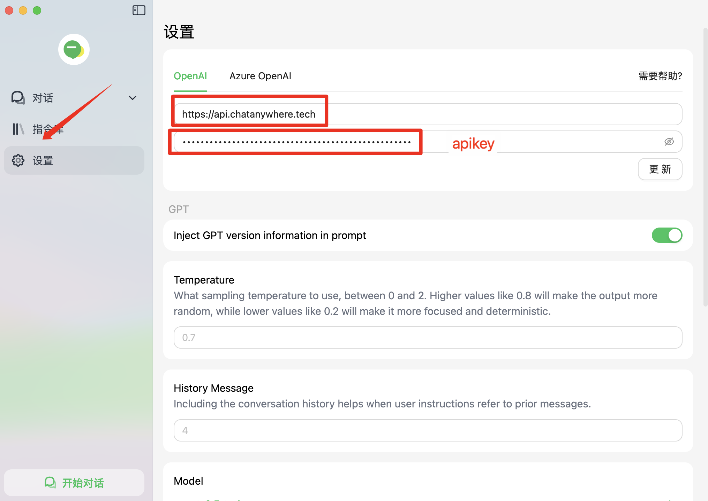

### **ChatBox**

ChatGPT开源桌面应用，支持全部桌面平台。

下载链接：https://github.com/Bin-Huang/chatbox/releases

使用方法：如图在设置中填入购买的密钥，并将代理设置为`https://api.chatanywhere.tech`即可

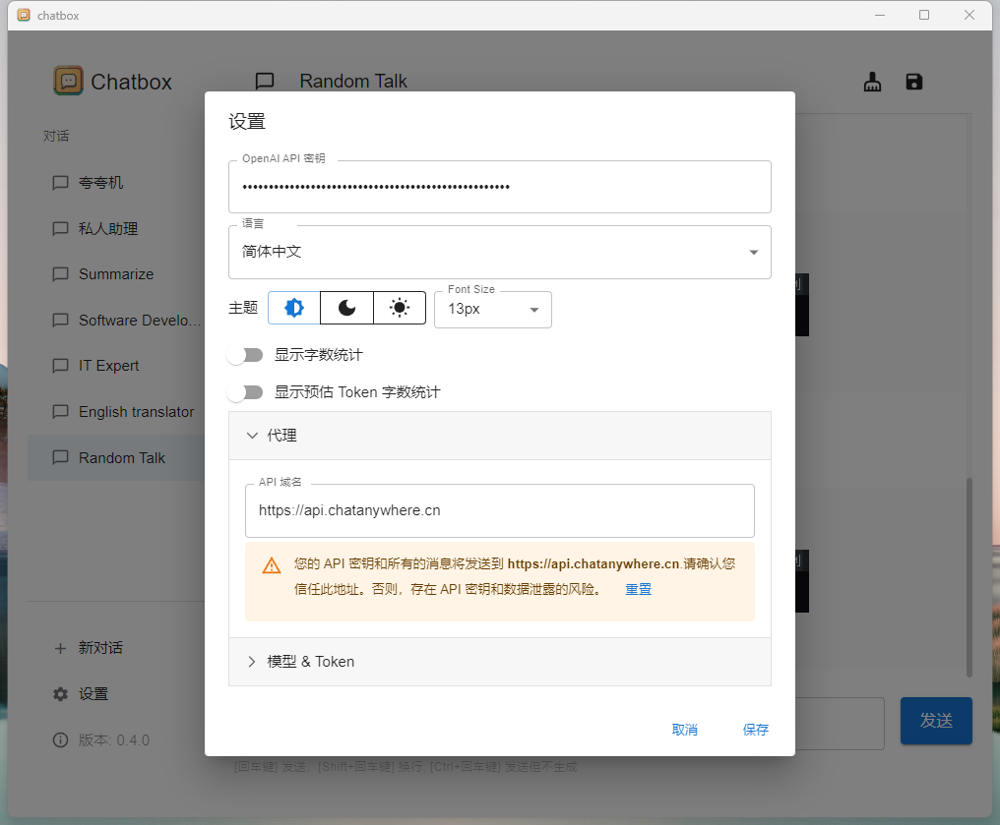

### **Zotero插件**

**pdf阅读插件zotero-gpt**

下载链接：https://github.com/MuiseDestiny/zotero-gpt/releases

安装好插件后使用以下命令设置，还是不会可以去b站搜教程。
```
/api https://api.chatanywhere.tech

/secretKey 购买的转发key 记住别忘记带sk-

# 切换模型命令
/model gpt-3.5-turbo-0125 
```

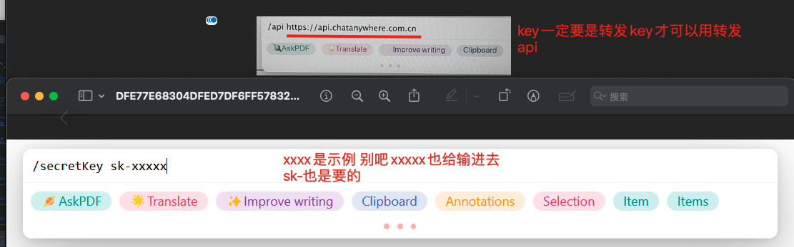


**翻译插件zotero-pdf-translate**

下载链接：https://github.com/windingwind/zotero-pdf-translate/releases

接口地址填写: https://api.chatanywhere.tech/v1/chat/completions

不用管状态是否显示可用 填上之后就可以了

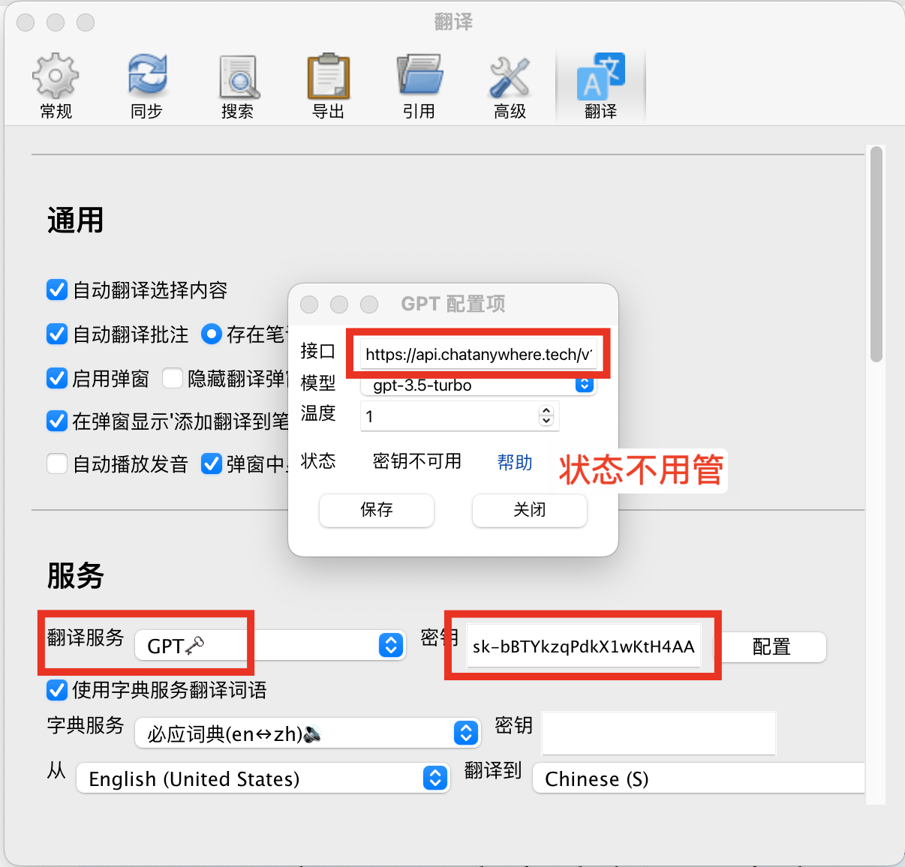


### **浏览器插件ChatGPT Sidebar**

官网链接：https://chatgpt-sidebar.com/

安装好插件后进入设置页面，如图所示修改设置，将url修改为 `https://api.chatanywhere.tech` 。

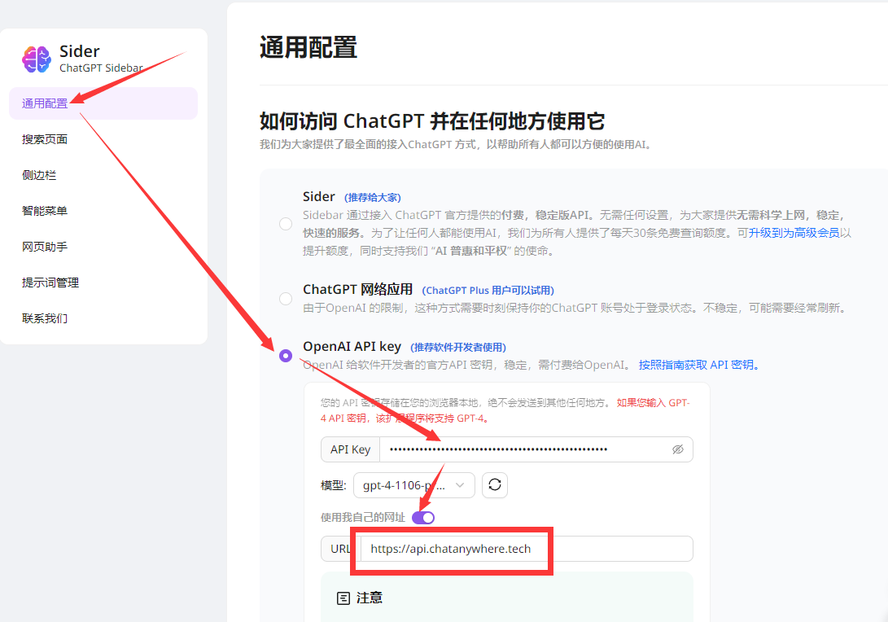

### **Jetbrains插件ChatGPT - Easycode**
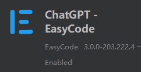

安装好插件后在Settings > Tools > OpenAI > GPT 3.5 Turbo中如图所示配置好插件，重点要将Server Settings 修改为 `https://api.chatanywhere.tech/v1/chat/completions` 。并勾选Customize Server。

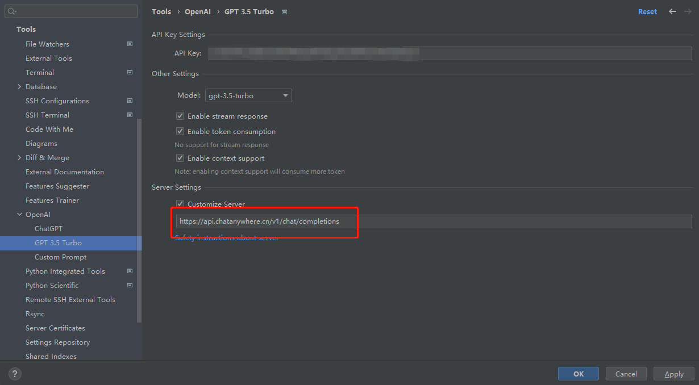


### **Raycast 插件 ChatGPT**

1. 在 Raycast Store 中找到 ChatGPT 插件，并按照提示安装：
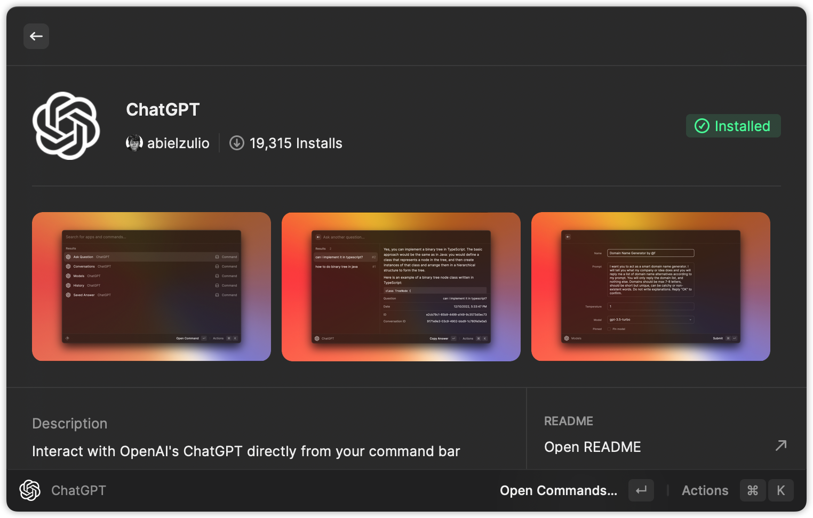

2. 安装完成后在该插件配置中的 `API Key` 中填入我们的API Key，以及选中 `Change API Endpoint`，并在 `API Endpoint` 中填入 `https://api.chatanywhere.tech/v1`
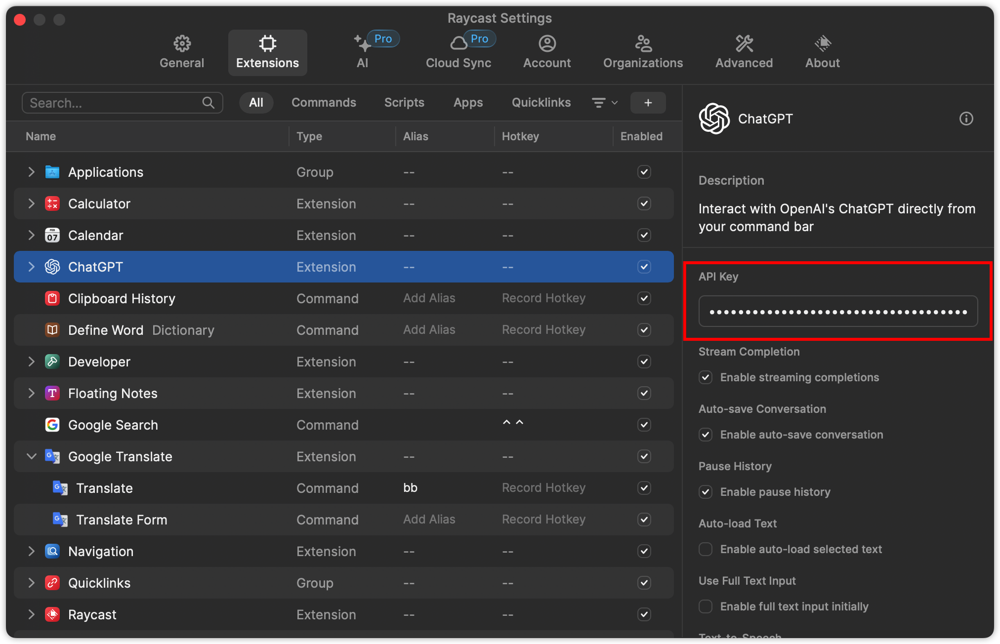
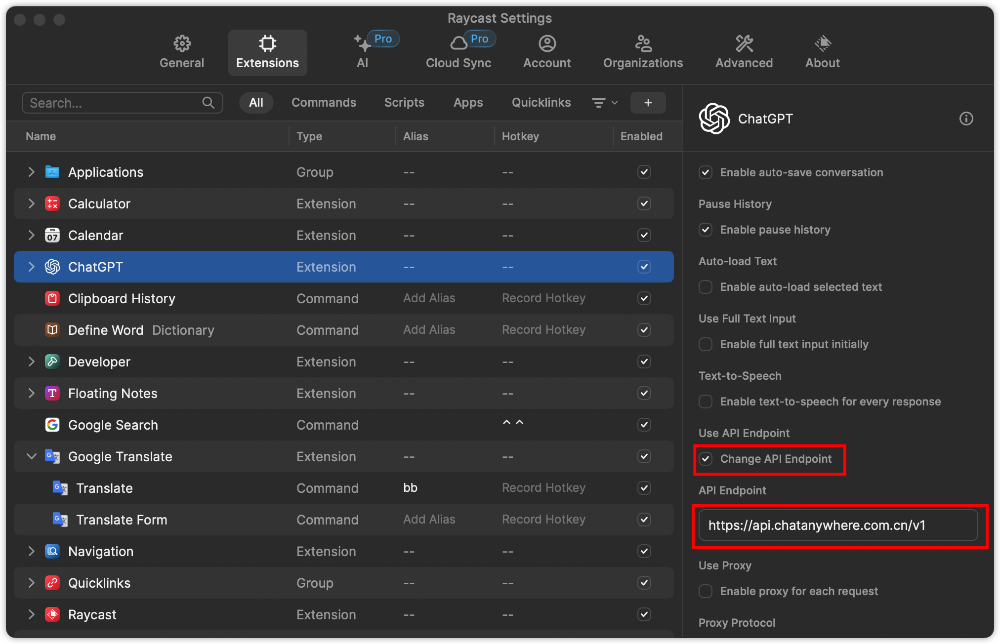

3. 🍺 enjoy it~


### **Tampermonkey 插件 Codeforces Better!**

1. 在 codeforces 网页右上角点击 `Codeforces Better! 设置`，找到 翻译 > ChatGPT > 配置管理 > + 添加，如图填写 key 和 Proxy API 项：
   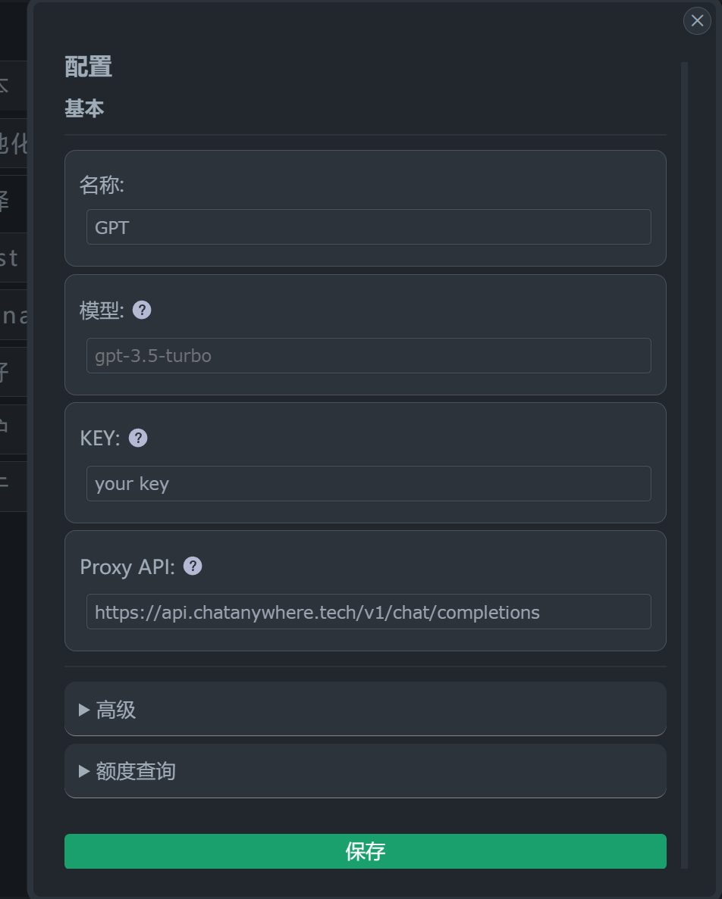

2. 完成后设置为 ChatGPT 翻译即可。
   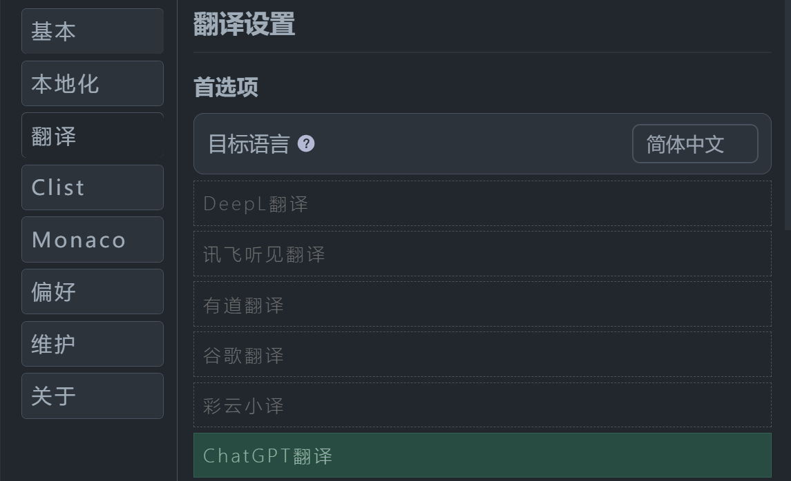

[](https://star-history.com/#chatanywhere/GPT_API_free&Date)
